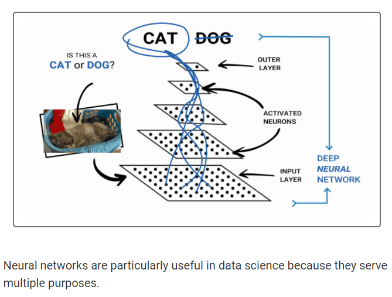
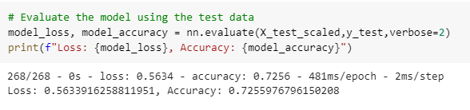
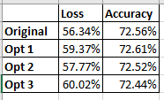

# Neural_Network_Charity_Analysis
In this challenge we helped a nonprofit foundation, Alphabet Soup, ho needed help analyzing the impact of their donations and vetting potential recipients by predicting which organizations are worth donating to and which are too high risk.

## Overview of the analysis: Explain the purpose of this analysis. 
The purpose of this analysis was to explore and implement neural networks using TensorFlow in Python. Neural networks are an advanced form of Machine Learning that can recognize patterns and features in the dataset. Neural networks are modeled after the human brain and contain layers of neurons that can perform individual computations.

## Data Preprocessing
- The IS_SUCCESSFUL column is considered the target for the model.
- The APPLICATION_TYPE, AFFILIATION, CLASSIFICATION, USE_CASE, ORGANIZATION, INCOME_AMT, and ASK_AMT columns equaled the features of the model.
- The EIN, NAME, STATUS, and SPECIAL_CONSIDERATION columns are neither targets nor features and were removed from the input data.

## Compiling, Training, and Evaluating the Model
Three additional attempts were made to increase the model's performance by changing features, adding/subtracting neurons, and epochs. The results did not show any improvement.

### Target Model Performance
For this model we aimed for 75% accuracy. Unfortunately, even with our three different optimizations we were unable to reach higher than 74%. 

- Optimization 1: The number of neurons in layer 1 was increased by 20. From 40 neurons to 60 neurons. A third layer was also added with 40 neurons. We saw no effect on the accuracy.
- Optimization 2: The layers were increased to four. In the fourth layer  we added 30 neurons. No effect was really seen.
- Optimization 3: For the third attempt, I decided to move  to remove the 4th layer since it showed no increase in accuracy. I set the 3 layers with increased neurons. Layer 1 containing 120 neurons, Layer 2 containing 80 neurons, and Layer 3 containing 60 neurons. This unfortunately, like the other attempts led to no increase in the accuracy.

## Summary: 
In summary, the model and various optimizations did not help to achieve the desired result of greater than 75%. With the variations of increasing the epochs, removing variables, adding a 3rd and even 4th hidden layer and/or increasing/decreasing the neurons, the changes were minimal and did not improve above 19 basis points. 
In reviewing other Machine Learning algorithms, the results did not prove to be any better. Neural Networks  have proved to be very intricate and would require experience through trial and error or many iterations to identify the perfect configuration to work with this dataset. 
